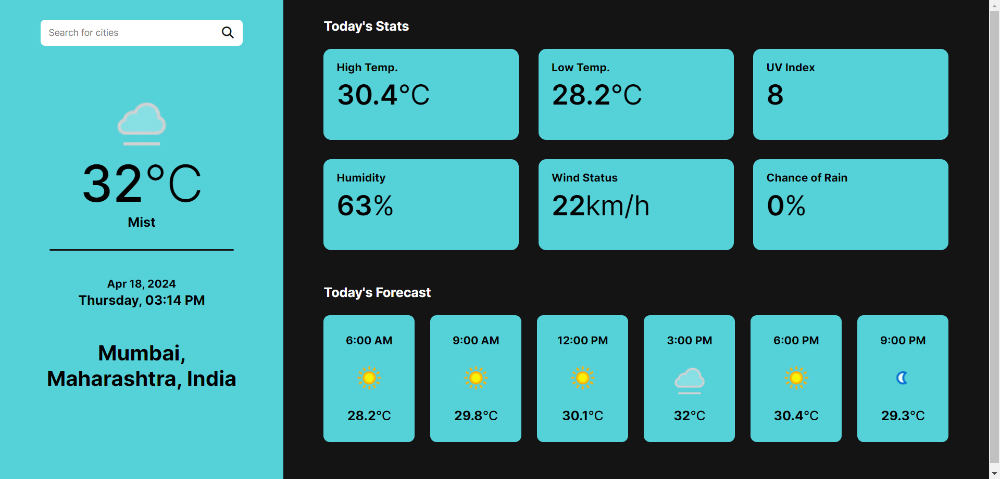

# Weather App
Hi, this repository contains a weather web application created using HTML, CSS, and JavaScript. The Weather App allows users to check the current weather conditions of any location worldwide. It provides real-time weather data such as temperature, humidity, wind speed, and weather description.

Built with:

  

## Output:

